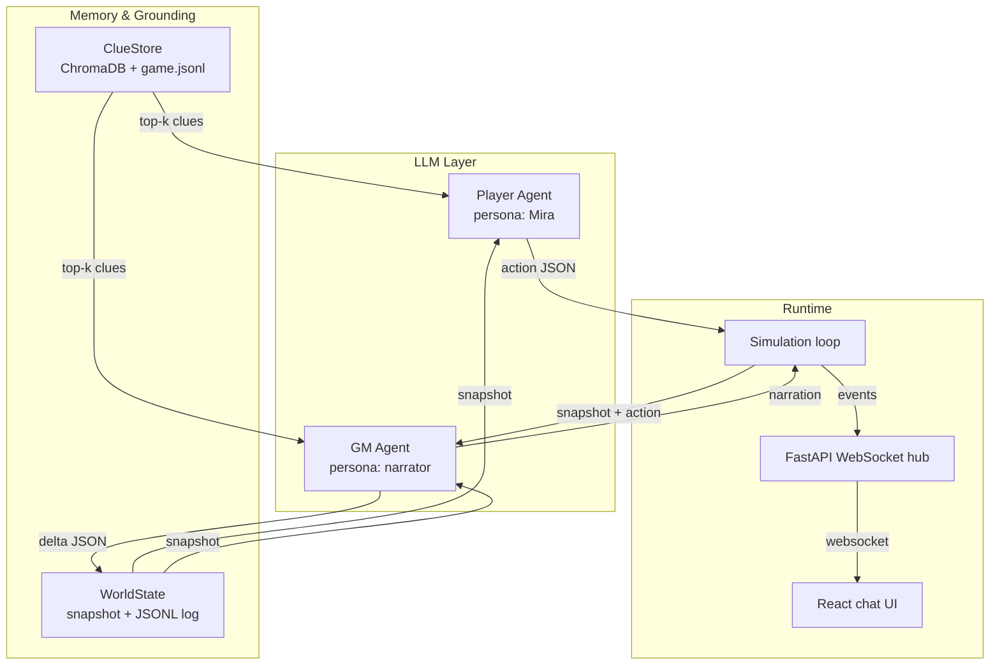

# Escapism — Project Document

## Vision

Prove that two cooperating LLM agents — a **Player** and a **Game Master** —
can play a narrative escape room end-to-end, with structured grounding to
prevent hallucination and a chat-style web UI to spectate the run.

The PoC is intentionally **narrative-only**: no grid, no sprites. The
"environment" is a JSON world state mutated by the GM, plus a clue corpus the
GM retrieves from before every adjudication.

## Cast

- **Mira "Ironhand" Castellanos** — Quartermaster. The Player Agent. Alone
  in the brig of the pirate brig *Black Vesper*. The other senior crew lie
  unconscious around her on the cell floor.
- **Game Master** — narrator, validator, and sole mutator of the world.

## Architecture



## Cognitive cycle (one turn)

```
1. Player Agent
   ├─ inputs: WorldState snapshot, last N events, retrieved clues
   ├─ output: { thought, say, action: { verb, target, args } }   (JSON)
2. Game Master Agent
   ├─ inputs: WorldState snapshot, player action, last N events, retrieved clues
   ├─ output: { narration, success, delta }                       (JSON)
3. Simulation
   ├─ applies delta to WorldState
   ├─ appends every step to JSONL event log
   └─ broadcasts to all WebSocket clients
```

## Action protocol (player → GM)

```json
{
  "thought": "internal monologue (not spoken)",
  "say":     "spoken aloud (empty if silent)",
  "action": {
    "verb":   "EXAMINE | SEARCH | TAKE | COMBINE | USE | WAIT | MOVE_TO | SAY",
    "target": "item / npc / object / location id (optional)",
    "args":   { "...": "verb-specific" }
  }
}
```

## Adjudication protocol (GM → world)

```json
{
  "narration": "2–5 sentences, second person",
  "success":   true,
  "delta": {
    "set":               { "<world_key>": "<value>" },
    "inventory_add":     ["item_id", "..."],
    "inventory_remove":  ["item_id", "..."],
    "npc_state":         { "<npc>": "<state>" },
    "object_state":      { "<object>": "<state>" },
    "discovered_items":  ["item_id"],
    "known_facts_add":   ["short sentence"],
    "objectives":        { "<obj_id>": "active|complete|failed" },
    "alarm_delta":       1,
    "time_advance_min":  2,
    "scene_id":          "act1:taking_stock",
    "current_location":  "lower_decks",
    "game_over":         "win|lose|poc_complete"
  }
}
```

## Data files

| File                          | Purpose                                    |
| ----------------------------- | ------------------------------------------ |
| `data/game.jsonl`             | LLM-facing clue corpus (one JSON per line) |
| `data/world_initial.json`     | Starting world snapshot                    |
| `data/runs/<ts>.events.jsonl` | Per-run event log (append-only)            |
| `data/runs/<ts>.world.json`   | Final world snapshot per run               |
| `data/chroma/`                | Persistent ChromaDB index (auto-built)     |

## Clue document shape (`game.jsonl`)

```json
{
  "id": "puzzle.sedate_hal",
  "kind": "puzzle | location | item | npc | rule | objective | hint | lore | meta",
  "scope": ["act1"],
  "title": "Short title",
  "text": "Long-form description used both as the embedding and as prompt context."
}
```

The ClueStore builds a ChromaDB collection from this file on first run. The
embedding function is ChromaDB's default (ONNX MiniLM) — no Ollama embedding
calls required. If ChromaDB cannot be imported (or fails for any reason),
the store falls back to a simple keyword retriever over the same corpus, so
the simulation always runs.

## Anti-hallucination posture

- Only the GM mutates the world, and only via a structured `delta`.
- Every GM prompt includes top-*k* retrieved clue documents.
- System rules instruct the GM never to invent items/NPCs/rooms not in those
  clues.
- A tolerant JSON parser extracts the first JSON object containing a `verb`
  (player) or `narration` (GM); malformed responses degrade to a safe WAIT.
- All deltas, narrations, and player actions are logged to JSONL for audit.

## Web UI

- React 18 + Vite + TypeScript + Tailwind.
- WebSocket subscriber renders a messenger-style chat:
  - Mira's **thought** — italic sea-green, right side.
  - Mira's **say** — ember bubble, right side.
  - Mira's **action** — brass monospace card, right side.
  - GM **narration** — dark stone bubble, left side.
  - GM **state_delta** — small monospace chip row showing diff notes.
- Right sidebar HUD: in-game time, minutes until Port Royal, location,
  alarm meter, inventory, objectives, last six known facts.

## Extension points

| Surface                | How to extend                                          |
| ---------------------- | ------------------------------------------------------ |
| New clue / room / item | Add a JSONL line; restart server to re-index Chroma.   |
| New verb               | Add to `PLAYER_ACTION_SCHEMA`, handle in `apply_delta` |
| Real LLM model         | `LLM_BACKEND=ollama PLAYER_MODEL=... GM_MODEL=...`     |
| Embedding backend      | Replace default in `ClueStore._init_chroma`            |
| Multi-agent            | Add more `PlayerAgent`s sharing one `WorldState`       |

## Run

```bash
# Mock smoke test (no deps needed beyond Python stdlib)
USE_CHROMA=0 LLM_BACKEND=mock python -m server smoke

# Live web app
pip install -r requirements.txt
LLM_BACKEND=mock python -m server          # backend on :8000
(cd client && npm install && npm run dev)  # UI on :5173

# Real LLM
ollama serve & ollama pull llama3.2
LLM_BACKEND=ollama PLAYER_MODEL=llama3.2 GM_MODEL=llama3.2 python -m server
```
